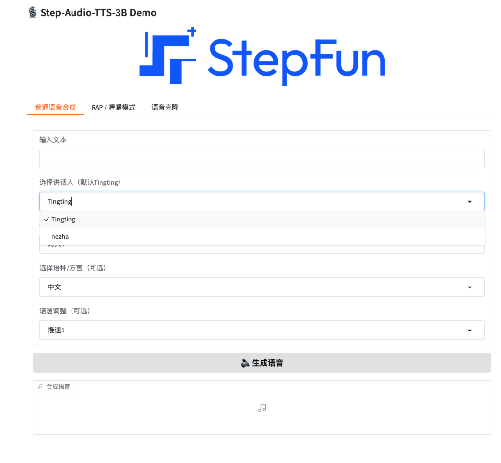
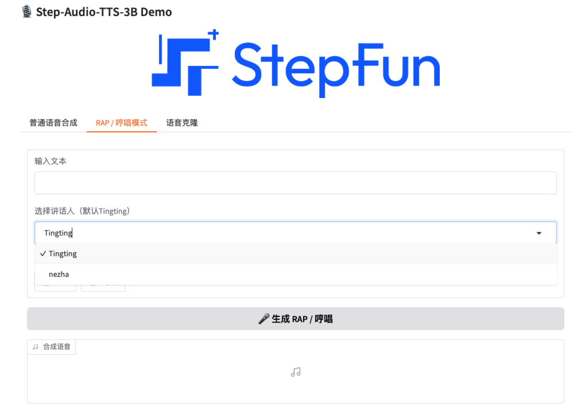
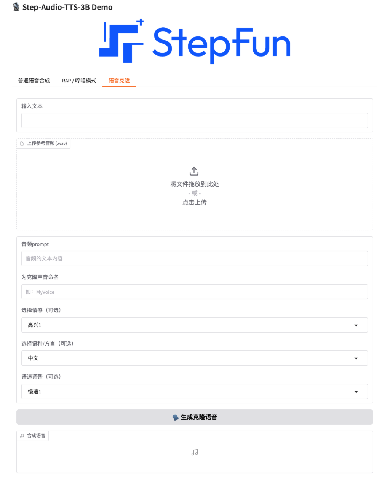

### env


```
git clone https://github.com/yikexiaoxing/Step-Audio.git
cd Step-Audio

mkdir models && cd models
git lfs install
git clone https://www.modelscope.cn/stepfun-ai/Step-Audio-TTS-3B.git
git clone https://modelscope.cn/models/stepfun-ai/Step-Audio-Tokenizer

# windows cuda12.6
conda create --name step-audio python==3.10
pip3 install torch torchvision torchaudio --index-url https://download.pytorch.org/whl/cu126
pip install -r requirements.txt

```


### 单独Step-Audio-TTS-3B 的网页演示


```bash
python gradio_app.py
```

**前端展示**


<center>普通语音合成


<center>RAP、哼唱模式


<center>语音克隆模式
